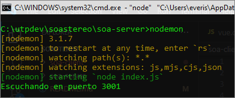
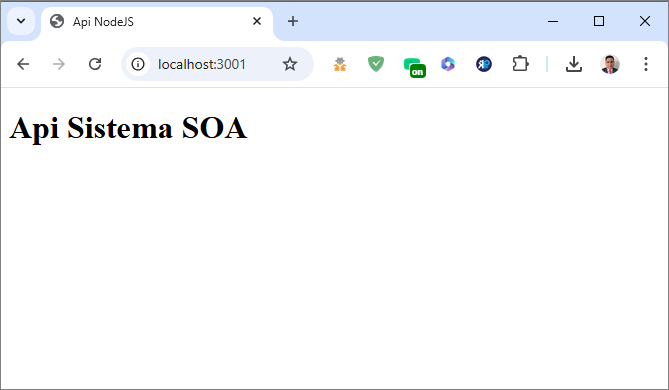
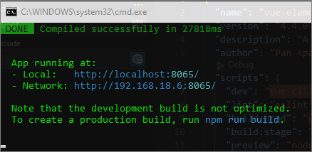
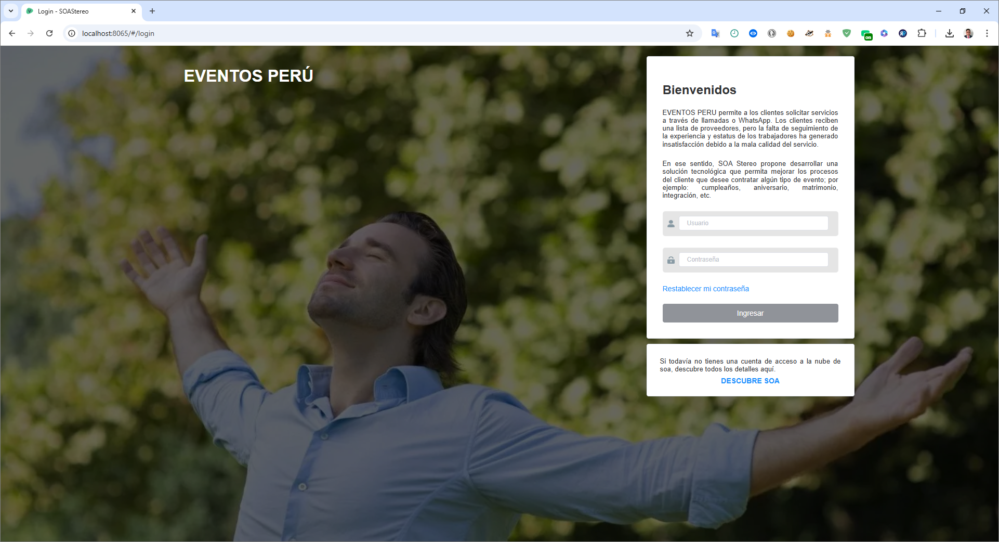

# Manual de Contribución al Proyecto Soastereo

Este documento describe el flujo de trabajo recomendado para contribuir al proyecto **Soastereo**. Sigue estos pasos para garantizar que todos los desarrolladores trabajen de manera coordinada y que el código permanezca limpio y fácil de mantener.

## Tabla de Contenidos
1. [Estructura de Ramas](#1-estructura-de-ramas)
2. [Primer Descarga del Proyecto](#2-primer-descarga-del-proyecto)
3. [Enviar Cambios al Repositorio](#3-enviar-cambios-al-repositorio)
4. [Actualizar el Proyecto con los Últimos Cambios](#4-actualizar-el-proyecto-con-los-últimos-cambios)
5. [Levantar el Proyecto](#5-levantar-el-proyecto)
---

## 1. Estructura de Ramas

Para facilitar el trabajo en equipo y evitar conflictos de código, seguimos una estructura de ramas:

- **master**: La rama principal del proyecto. Solo contiene código estable. No se deben hacer cambios directos en esta rama.
- **feature/<nombre-funcionalidad>**: Cada desarrollador trabaja en su propia rama basada en `master`. Crea una nueva rama para cada funcionalidad, mejora o corrección.

### Nombres de Ramas
Usa el siguiente formato para nombrar tus ramas de trabajo:

```plaintext
feature/nombre-funcionalidad
bugfix/nombre-error
```

Ejemplos:
- `feature/login-page`
- `bugfix/fix-login-error`

---

## 2. Primer Descarga del Proyecto

Para descargar el proyecto por primera vez:

1. **Clona el repositorio**:

   ```bash
   git clone https://github.com/fingerbass/soastereo.git
   ```

2. **Navega al directorio del proyecto**:

   ```bash
   cd soastereo
   ```

3. **Crea una nueva rama** basada en `master`:

   ```bash
   git checkout -b feature/nombre-funcionalidad
   ```

Esta rama será tu espacio de trabajo para hacer cambios en el proyecto.

---

## 3. Enviar Cambios al Repositorio

Cuando hayas realizado cambios en tu rama y quieras compartirlos con el equipo:

1. **Guarda y confirma (commit) tus cambios** en tu rama local:

   ```bash
   git add .
   git commit -m "Descripción de los cambios realizados"
   ```

2. **Envía (push) los cambios a tu rama en el repositorio remoto**:

   ```bash
   git push origin feature/nombre-funcionalidad
   ```

3. **Crea un Pull Request (PR)** desde GitHub:
   - Ve a [GitHub](https://github.com/fingerbass/soastereo).
   - Haz clic en **Pull Requests** y selecciona **New Pull Request**.
   - Selecciona tu rama como la rama de origen (`feature/nombre-funcionalidad`) y `master` como la rama de destino.
   [text](README.md)
   - Agrega una descripción detallada de los cambios y envía el PR.

4. **Espera la revisión**: Los demás desarrolladores revisarán tu PR, harán comentarios o sugerencias y lo aprobarán si está listo para fusionarse.

5. **Fusionar el PR**: Una vez aprobado, podrás fusionar el PR en `master`. **Nota**: Solo los colaboradores autorizados deben hacer merges a `master`.

---

## 4. Actualizar el Proyecto con los Últimos Cambios

Para asegurarte de que siempre estás trabajando con la versión más reciente del proyecto:

1. **Cambia a la rama `master`**:

   ```bash
   git checkout master
   ```

2. **Obtén los últimos cambios de `master` desde el repositorio remoto**:

   ```bash
   git pull origin master
   ```

3. **Fusiona los cambios recientes en tu rama de trabajo**:
   - Cambia a tu rama de trabajo:

     ```bash
     git checkout feature/nombre-funcionalidad
     ```

   - Fusiona los últimos cambios de `master` en tu rama:

     ```bash
     git merge master
     ```

   Esto traerá los últimos cambios de `master` a tu rama de trabajo. Si existen conflictos, Git te pedirá que los resuelvas antes de completar el merge.

4. **Continúa trabajando en tu rama** y repite el ciclo de `commit`, `push` y PR cuando estés listo para compartir cambios.

---

## Resumen del Flujo de Trabajo

1. **Crear una nueva rama** para cada tarea o funcionalidad.
2. **Hacer commit y push** en tu propia rama.
3. **Crear un Pull Request** para revisión y aprobación.
4. **Actualizar tu rama de trabajo** con los últimos cambios de `master`.

---

## Notas Adicionales

- **Evita hacer commits directamente en `master`**.
- **Comunicación**: Si encuentras un problema o necesitas ayuda, usa los comentarios en GitHub o escríbe al grupo interno de WhatsApp.
- **Documentación**: Añade comentarios y documentación en el código cuando sea necesario para facilitar la comprensión de los cambios realizados.

---

Este flujo de trabajo ayudará a mantener el código organizado y reducirá los conflictos al trabajar en equipo. ¡Feliz codificación!


## 5. Levantar el Proyecto

Para ejecutar el proyecto **Soastereo**, sigue las instrucciones específicas para levantar el servidor (`soa-server`) y el cliente (`soa-client`).

### Requisitos Previos

Si es la primera vez que levantas el proyecto, es necesario instalar las dependencias de cada uno de los módulos.

#### Instalación de Dependencias

1. **Instalar dependencias del servidor**: Navega a la carpeta `soa-server` y ejecuta el siguiente comando para instalar las dependencias globales necesarias, incluido `nodemon`:

   ```bash
   npm install -g nodemon
   ```

2. **Instalar dependencias locales en cada módulo**: Ejecuta el siguiente comando en las carpetas `soa-server` y `soa-client` para instalar las dependencias locales:

   ```bash
   npm install
   ```

### Levantar el Servidor (soa-server)

Para levantar el servidor, abre una ventana de **Símbolo del sistema (CMD)**, navega a la carpeta `soa-server` y ejecuta el siguiente comando:

```bash
nodemon
```



Este comando iniciará el servidor en modo de desarrollo, lo que permite una recarga automática cuando se realizan cambios en el código. El puerto donde estará activo es el 3001, por lo tanto si quieres consultar o hacer pruebas a los servicios expuestos será desde la URL http://localhost:3001



### Levantar el Cliente (soa-client)

Para levantar el cliente, abre otra ventana de **Símbolo del sistema (CMD)**, navega a la carpeta `soa-client` y ejecuta el siguiente comando:

```bash
npm run dev
```



Esto iniciará el entorno de desarrollo del cliente, que estará disponible en el navegador para realizar pruebas. Automáticamente se levantará la url http://localhost:8065



---

Siguiendo estas instrucciones, podrás levantar tanto el servidor como el cliente y ejecutar el proyecto completo en tu entorno local.